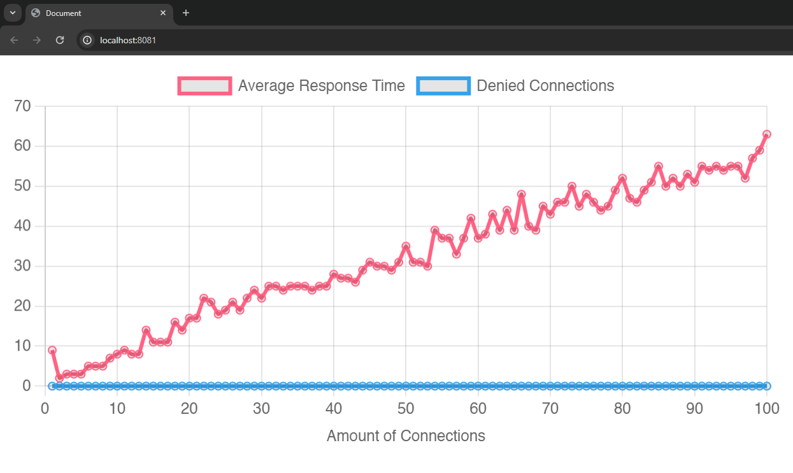

# Api Tester

This Go program is a simple benchmark tool designed to test the performance of a server. It automatically makes requests to the server and scales up the amount of requests made at once to measure the response time.

It will open a web browser that displays a graph. This graph gets updated every second.



## Usage

```bash
go build
```

```bash
./api-tester -e [endpoint] -p [port] -s [start-workers] -m [max-workers]
```

- `-e, --endpoint`: The endpoint to test (required).
- `-p, --port`: The port the webserver is running on (default: 8081).
- `-s, --start-workers`: The amount of workers to start with (default: 1).
- `-m, --max-workers`: The maximum amount of workers to test (default: 100).

## Example

```bash
./api-tester -e "http://localhost:3000/api/random/endpoint"
```
